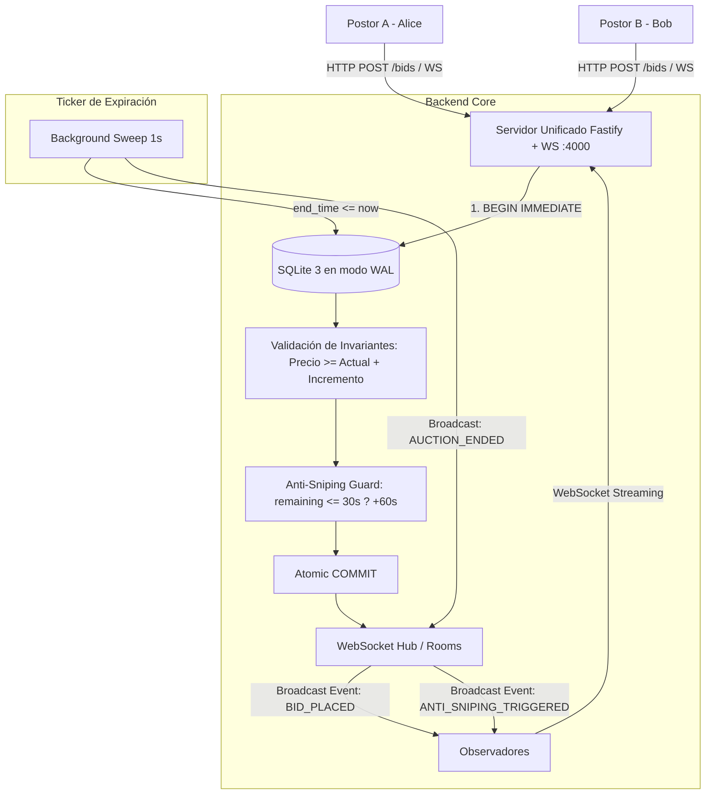

# Live Auction Engine

[](https://github.com/jimmyrom1/live-auction-engine/actions/workflows/ci.yml)
[](https://nodejs.org/)
[](https://www.typescriptlang.org/)
[](https://www.sqlite.org/wal.html)
[](https://github.com/websockets/ws)
[](https://react.dev/)
[](https://opensource.org/licenses/MIT)

> **Motor de subastas concurrentes en tiempo real con WebSockets nativos, base de datos SQLite en modo WAL, resolución atómica de carreras concurrentes en milisegundos y mecanismo anti-sniping.** Incluye interfaz web reactiva en React 19 con cuenta atrás sincronizada, transmisión en directo de pujas y un simulador interactivo para provocar y auditar carreras de concurrencia en vivo.

---

## 📑 Tabla de Contenidos
- [El problema que resuelve](#el-problema-que-resuelve)
- [Arquitectura del Sistema](#arquitectura-del-sistema)
- [Reglas de Negocio Garantizadas](#reglas-de-negocio-garantizadas)
- [Mecanismo Anti-Sniping](#mecanismo-anti-sniping)
- [Decisiones Técnicas y Trade-offs](#decisiones-técnicas-y-trade-offs)
- [Retos de Concurrencia y Bugs Superados](#retos-de-concurrencia-y-bugs-superados)
- [Puesta en Marcha](#puesta-en-marcha)
  - [Requisitos](#requisitos)
  - [Ejecución en Local (sin Docker)](#ejecución-en-local-sin-docker)
  - [Ejecución con Docker Compose](#ejecución-con-docker-compose)
  - [Simulación de Carreras Concurrentes](#simulación-de-carreras-concurrentes)
- [Otros proyectos del portfolio](#otros-proyectos-del-portfolio)

---

## El problema que resuelve

En sistemas de subastas en vivo existen tres desafíos técnicos críticos:

1. **Carreras concurrentes al milisegundo:** Cuando múltiples postores envían pujas por el mismo importe o con diferencias mínimas en el mismo milisegundo, una base de datos sin aislamiento estricto puede registrar ambas, provocando estados incoherentes o cobros duplicados. Se requiere una transacción atómica `BEGIN IMMEDIATE` que adjudique el liderazgo a la primera puja recibida y rechace de inmediato las demás con `409 Conflict`.
2. **El problema del *Bid Sniping* (Bots de última décima):** En subastas con final fijado a reloj estricto, usuarios o scripts automatizados esperan a los últimos 500 ms para pujar, impidiendo que el postor anterior tenga tiempo material de reaccionar. El sistema implementa un **mecanismo anti-sniping dinámico**: si entra una puja válida dentro de los últimos 30 segundos, el tiempo de cierre se amplía automáticamente 60 segundos.
3. **Distribución en tiempo real sin saturación de base de datos:** El polling HTTP periódico satura los servidores y degrada la experiencia con latencias de 1-2 segundos. El sistema mantiene un canal bidireccional mediante **WebSockets con salas (*rooms*) por subasta**, transmitiendo la nueva puja líder, la extensión de tiempo y el estado final a todos los observadores en menos de 5 milisegundos.

---

## Arquitectura del Sistema



---

## Reglas de Negocio Garantizadas

Todas las restricciones operativas se evalúan de forma determinista dentro de transacciones de base de datos aisladas:

1. **Primera puja:** Puede igualar el precio de salida (`starting_price`).
2. **Pujas sucesivas:** Deben cumplir estrictamente:
   $$\text{importe\_puja} \ge \text{precio\_actual} + \text{incremento\_mínimo}$$
   Cualquier puja que incumpla la regla es rechazada con código `BID_TOO_LOW` (409 Conflict).
3. **Prohibición de auto-sobrepuja (*Self-bidding protection*):** El postor que ostenta la puja líder actual no puede volver a pujar sobre sí mismo (`SELF_BIDDING_DISALLOWED`, 400).
4. **Cierre irreversible de subasta:** Una vez superado el `end_time` (o en estado `ENDED`), ninguna puja es aceptada (`AUCTION_EXPIRED`, 409).
5. **Precios en céntimos enteros:** Todos los importes se almacenan y calculan en céntimos (números enteros de 64 bits) para erradicar imprecisiones de coma flotante IEEE 754.

---

## Mecanismo Anti-Sniping

- **Ventana de activación:** Por defecto, 30 segundos antes del vencimiento (configurable por subasta).
- **Extensión temporal:** Cada puja válida recibida dentro de la ventana extiende el `end_time` en 60 segundos adicionales.
- **Trazabilidad:** Cada puja almacena el flag booleano `extended_auction` y la subasta incrementa su contador `sniping_extensions_count`.
- **Notificación en tiempo real:** Se emite el evento WebSocket `ANTI_SNIPING_TRIGGERED` a todos los clientes suscritos para actualizar la cuenta atrás visual y alertar a los demás postores.

---

## Decisiones Técnicas y Trade-offs

1. **SQLite nativo en modo WAL (`node:sqlite`):**
   - *Decisión:* Emplear el motor nativo `DatabaseSync` de Node.js con `PRAGMA journal_mode = WAL;`.
   - *Ventaja:* Cero dependencias nativas de compilación (sin node-gyp ni librerías C++ externas). Las lecturas son completamente concurrentes sin bloquear a los escritores, y las escrituras usan `BEGIN IMMEDIATE` para serializar atómicamente las pujas con tiempos de ejecución de microsegundos en disco local.
2. **WebSockets nativos (`ws`) con Rooms por ID:**
   - *Decisión:* Servidor de WebSockets integrado en el mismo listener HTTP de Fastify en la ruta `/ws`.
   - *Ventaja:* Minimiza el consumo de memoria respecto a frameworks pesados como Socket.io y permite suscripción selectiva mediante mensajes `SUBSCRIBE` y `UNSUBSCRIBE`.
3. **Heartbeat proactivo (Ping / Pong cada 30s):**
   - *Decisión:* Envío periódico de tramas Ping para limpiar sockets zombies y reconexión automática con reintentos exponenciales en el cliente frontend.
4. **Simulador de Carreras Concurrentes en el Frontend:**
   - *Decisión:* Incluir un panel con 3 identidades simuladas (*Alice*, *Bob*, *Charlie*) y un botón de "Simular Carrera Concurrente" que dispara 3 peticiones simultáneas con el mismo importe para demostrar en vivo el rechazo atómico por conflicto.

---

## Retos de Concurrencia y Bugs Superados

1. **Carreras simultáneas con el mismo importe exacto:**
   - Cuando dos postores disparaban su petición en el mismo milisegundo por el importe mínimo, ambos leían el precio anterior y ambas pasaban la validación.
   - *Solución:* Utilizar `BEGIN IMMEDIATE` en SQLite para garantizar que la comprobación de `current_price` y la inserción del nuevo registro de puja sucedan de forma indivisible. El primer postor adquiere el lock de escritura y actualiza el precio; el segundo postor lee el precio recién actualizado y su puja es rechazada limpiamente con `BID_TOO_LOW`.
2. **Sincronización del reloj en el cliente:**
   - Si el reloj del navegador del usuario difiere del servidor, la cuenta atrás local mostraba subastas finalizadas antes de tiempo.
   - *Solución:* Los eventos de WebSocket transmiten el timestamp de vencimiento absoluto (`end_time` en Unix ms) y el servidor valida el tiempo en la base de datos de manera autoritativa.

---

## Puesta en Marcha

### Requisitos
- **Node.js 22.5+** (recomendado **Node.js 24**).
- `npm` 10+.
- Opcionalmente Docker y Docker Compose.

### Ejecución en Local (sin Docker)

1. Clonar el repositorio e instalar dependencias:
   ```bash
   git clone https://github.com/jimmyrom1/live-auction-engine.git
   cd live-auction-engine
   npm run install:all
   ```

2. Ejecutar la suite completa de tests (backend y frontend):
   ```bash
   npm run test:backend
   npm run test:frontend
   ```

3. Compilar el proyecto e iniciar el servidor:
   ```bash
   npm run build
   npm start
   ```

4. Abrir en el navegador:
   ```text
   http://localhost:4000
   ```
   La aplicación servirá el backend con Fastify, los WebSockets en `/ws` y la interfaz React 19 construida.

### Ejecución con Docker Compose

```bash
docker compose up --build
```
La aplicación quedará disponible en `http://localhost:4000` con persistencia del archivo SQLite en el volumen `auction_data`.

### Simulación de Carreras Concurrentes

Desde la interfaz web:
1. Haz clic en el botón naranja **"⚡ Simular Carrera Concurrente (3 Postores Simultáneos)"**.
2. Observarás cómo Alice, Bob y Charlie intentan pujar al mismo tiempo: uno gana la carrera y los otros dos reciben inmediatamente el error de conflicto atómico `409 Conflict: Bid too low`.

Mediante `curl`:
```bash
# Comprobar healthcheck
curl http://localhost:4000/healthz

# Listar subastas activas
curl http://localhost:4000/api/auctions

# Enviar una puja
curl -X POST http://localhost:4000/api/auctions/demo-auction-rolex/bids \
  -H "Content-Type: application/json" \
  -d '{"bidder_id":"curl-user","bidder_name":"Tester","amount":520000}'
```

---

## Otros proyectos del portfolio

| Proyecto | Tecnologías | Descripción |
| :--- | :--- | :--- |
| **[subscription-billing-dotnet](https://github.com/jimmyrom1/subscription-billing-dotnet)** | .NET 9, C#, EF Core, SQLite | Motor de facturación recurrente con prorrateo exacto al segundo, dunning de 3 intentos e idempotencia HTTP. |
| **[rate-limiter-grpc](https://github.com/jimmyrom1/rate-limiter-grpc)** | Go, gRPC, Protobuf, Concurrencia | Limitador de tráfico (~90 ns/op) con Token Bucket, Sliding Window y Circuit Breaker. |
| **[double-entry-ledger](https://github.com/jimmyrom1/double-entry-ledger)** | FastAPI, Asyncpg, PostgreSQL, React | Motor contable de partida doble inmutable con invariante de balance cero diferido en base de datos. |
| **[subscriptions-api](https://github.com/jimmyrom1/subscriptions-api)** | Java 21, Spring Boot 4, ShedLock, PostgreSQL | API fintech de suscripciones recurrentes con prorrateo exacto y tareas periódicas distribuidas. |
| **[room-booking](https://github.com/jimmyrom1/room-booking)** | Flask, PostgreSQL, React | Reserva de salas con exclusión de solapes mediante PostgreSQL `EXCLUDE USING gist`. |
| **[mini-invoice-generator](https://github.com/jimmyrom1/mini-invoice-generator)** | Flask, PostgreSQL, fpdf2, React | Generador de facturas con cálculo exacto de impuestos y renderizado PDF profesional. |
| **[lol-tracker](https://github.com/jimmyrom1/lol-tracker)** | Kotlin, Jetpack Compose, Room v3, WorkManager | App Android nativa offline-first con sincronización en segundo plano. |
| **[lol-tracker-api](https://github.com/jimmyrom1/lol-tracker-api)** | Node.js, Fastify, TypeScript | Proxy backend seguro con rate limiting y caché intermedia para la API de Riot Games. |
| **[anime-tracker](https://github.com/jimmyrom1/anime-tracker)** | ASP.NET Core 10, EF Core, PostgreSQL, Angular 22 | Lista de anime y manga al estilo MyAnimeList con catálogo de AniList, +1 concurrente sin pérdidas y estadísticas. |
